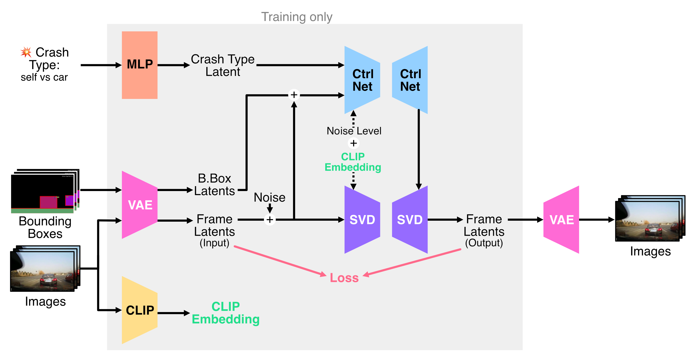

# 💥 Ctrl-Crash: Controllable Diffusion for Realistic Car Crashes

Generate car crash videos conditioned from an initial frame and using bounding-box and crash type conditioning.

<p align="center">
   
   
   
</p>
(Above) Generated crash videos

<p align="center">

</p>

## Setup

### Installing Dependencies

1. Clone repo
   ```bash
   git clone https://github.com/CtrlCrash-Anonymous/Ctrl-Crash-Anonymous.git
   cd Ctrl-Crash-Anonymous
   ```

2. Create a new conda environment:
   ```bash
   conda env create -f environment.yaml
   conda activate ctrl-crash
   ```

### Downloading Models

- **Pretrained Models**:  
  Link to the pretrained model checkpoint: https://drive.google.com/drive/folders/1zME-pcQnW2ThZwrkZcVJV-_OhKtXMIRJ?usp=sharing

- **HuggingFace Model**:  
  For video diffusion training, the script uses the model ID `stabilityai/stable-video-diffusion-img2vid-xt`. Ensure you have the necessary permissions and credentials to download it.


### Downloading Datasets

- **Dataset annotations**:  
  Link to the dataset annotations: https://drive.google.com/drive/folders/1zME-pcQnW2ThZwrkZcVJV-_OhKtXMIRJ?usp=sharing. 

TODO: Show expected dataset structure

## Run

The repository training scripts for the two training stages:

1. **Video Diffusion Training**
   - `mmau_train_video_diffusion_multigpu.sh`: Multi-GPU training for video diffusion
   - `mmau_train_video_diffusion_singlegpu.sh`: Single-GPU training for video diffusion
   - These scripts train a video diffusion model based on Stable Video Diffusion

2. **ControlNet Training (Action-Conditioned)**
   - `controlnet_train_action_multigpu.sh`: Multi-GPU training for action-conditioned video generation
   - `controlnet_train_action_singlegpu.sh`: Single-GPU training for action-conditioned video generation
   - These scripts train a model that generates videos conditioned on bounding boxes and action types

### Running the Scripts

1. Configure the user-specific settings at the top of each script:
   ```bash
   DATASET_PATH="<path/to/datasets>"  # Your dataset directory
   NAME="<experiment_name>"           # Name for this training run
   OUT_DIR="<path/to/output>/${NAME}" # Where to save results
   PROJECT_NAME='<wandb_project_name>' # Weights & Biases project name
   WANDB_ENTITY='<wandb_username>'    # Your Weights & Biases username
   PRETRAINED_MODEL_PATH="<path/to/pretrained/model>" # Model checkpoint path
   ```

2. Make the script executable and run:
   ```bash
   sh scripts/box2video_train_action_multigpu.sh
   ```

3. Monitor training:
   - Checkpoints are saved every 300 steps
   - Training progress is logged to Weights & Biases
   - Validation samples are generated periodically

Note: The scripts use Accelerate for distributed training. Make sure you have the appropriate config files in the `config/` directory.

## Inference and Evaluation

**Generating Videos**

To generate a batch of videos run:

```bash
python run_gen_videos.py \
    --model_path /path/to/model/checkpoint \
    --output_path /path/to/output/videos \
    --data_root /path/to/dataset_root \
    --num_demo_samples 100 \
    --max_output_vids 100 \
    --num_gens_per_sample 1 \
    --eval_output
```

See [eval README](src/eval/README.md#video-generation) for more details.

TODO: Notebook for interactive generation.

**Evaluation**
For computing evaluation metrics such as FVD over the generated videos run:

```bash
python video_quality_metrics_fvd_pair.py \
    --vid_root /path/to/videos \
    --samples 200 \
    --num_frames 25 \
    --downsample
```

See [eval README](src/eval/README.md) for more details and for other metrics.

## Dataset Preprocessing (Optional)

Instead of downloading the preprocessing datasets, you may choose to preprocess them yourself. Scripts and instructions for preparing datasets (frame extraction, cropping, bounding-box label generation, train/val split) are provided in the [preprocess README](src/preprocess/README.md). See that file for details on supported datasets and usage examples.


**NOTE**: This repository is actively being updated, changes and bug fixes can be expected in the days/weeks to come
